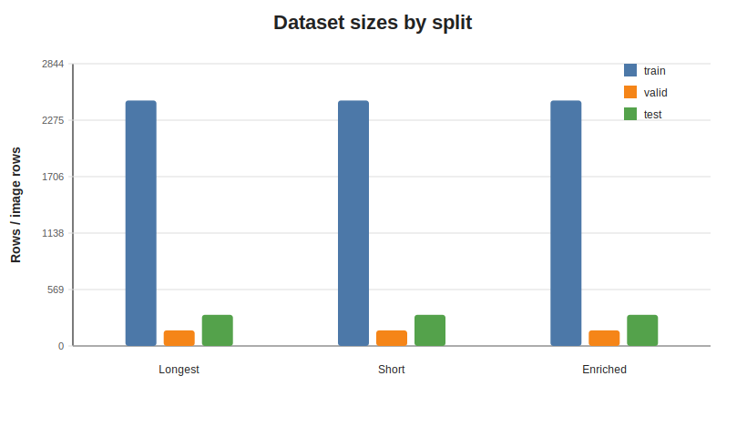
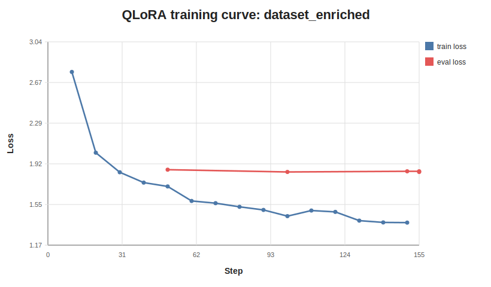
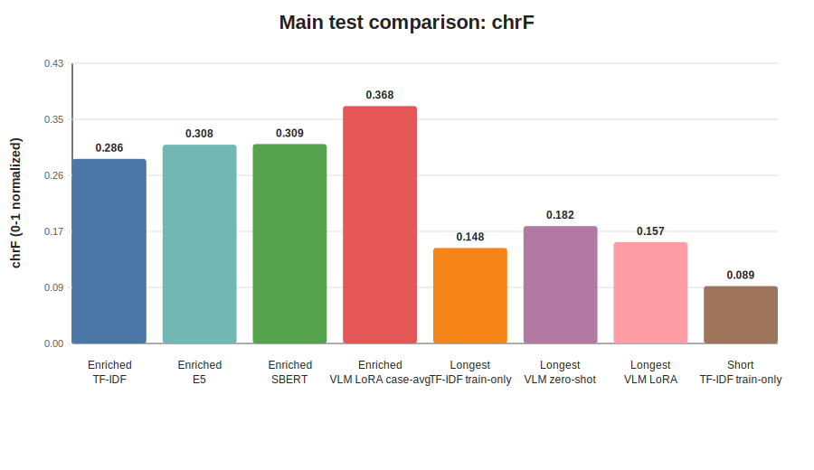
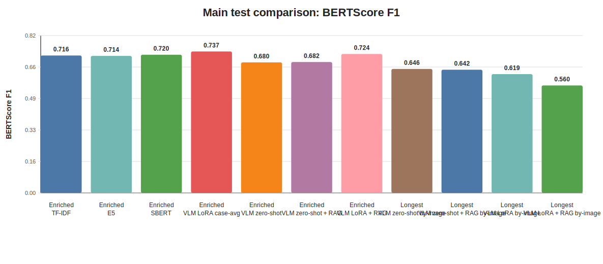
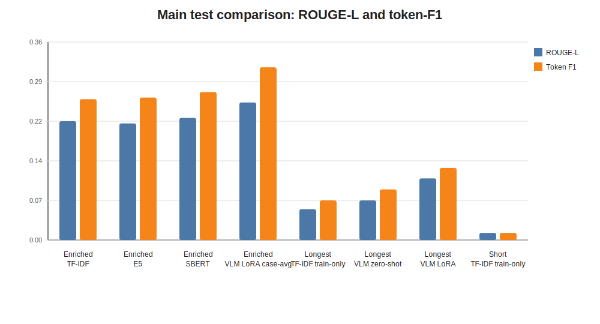
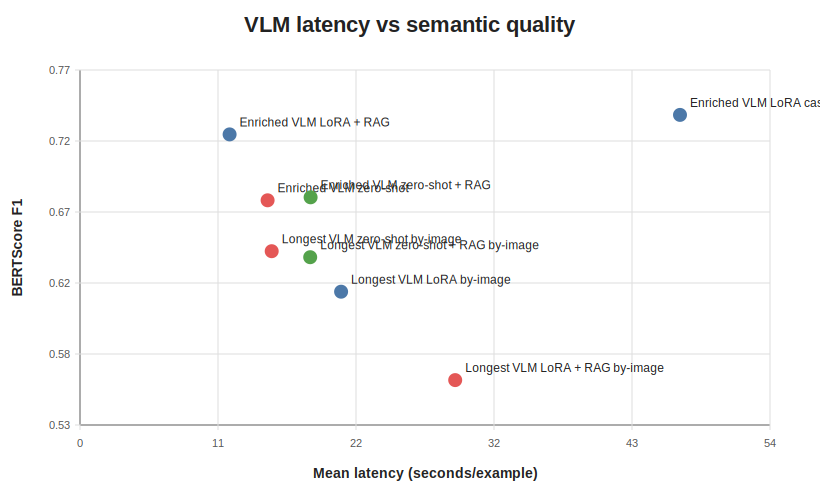
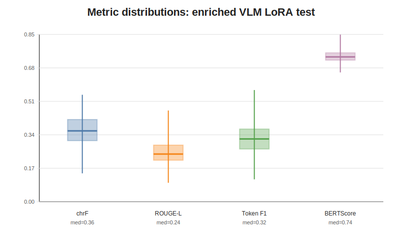
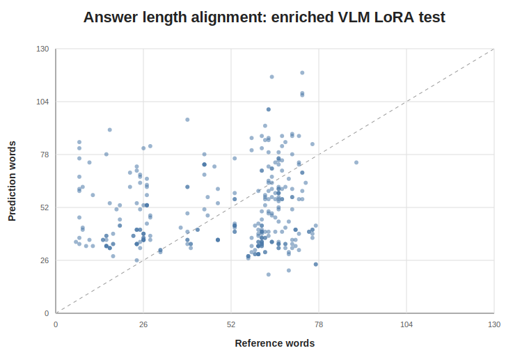

# Adaptación eficiente de modelos visión-lenguaje para VQA dermatológico en español

## Resumen

Este trabajo estudia la adaptación de modelos visión-lenguaje para responder
consultas dermatológicas en español a partir de imágenes clínicas. Partimos de
DermaVQA-IIYI, un conjunto con casos dermatológicos, imágenes y múltiples
respuestas médicas por caso. Para reducir la heterogeneidad de las respuestas,
construimos una variante enriquecida del dataset mediante síntesis textual: un
LLM integra las respuestas originales de cada caso en una única respuesta
clínica concisa en español. Luego comparamos baselines de recuperación textual
con un modelo Qwen2.5-VL-3B-Instruct adaptado mediante QLoRA/LoRA. En el target
enriquecido, el VLM fine-tuneado supera a TF-IDF, E5 y SBERT retrieval en chrF
medio, ROUGE-L, token-F1, BERTScore F1 y chrF corpus, aunque no en sacreBLEU
corpus. Una revisión preliminar de 20 casos muestra que las mejoras automáticas
no garantizan seguridad clínica: aparecen diagnósticos no respaldados,
recomendaciones no sustentadas y errores de severidad alta. Por lo tanto, el
resultado principal es metodológico: el enriquecimiento textual y LoRA son
prometedores para adaptación multimodal médica en español, pero requieren
auditoría clínica antes de cualquier uso asistencial.

## 1. Introducción

El VQA médico multimodal combina comprensión visual, lenguaje clínico y
seguimiento de instrucciones. En dermatología, las imágenes son especialmente
relevantes, pero el diagnóstico también depende de la consulta del paciente, la
historia clínica y la forma en que se redacta la respuesta. Esta dificultad se
acentúa en español, donde existen menos benchmarks y menos modelos adaptados al
dominio médico.

Este proyecto pregunta si, bajo restricciones realistas de datos y cómputo, es
preferible recuperar respuestas de casos similares o adaptar un VLM liviano con
LoRA/QLoRA. Nos centramos en tres caminos:

1. baselines de recuperación textual;
2. inferencia zero-shot con un VLM general;
3. fine-tuning QLoRA/LoRA de Qwen2.5-VL-3B-Instruct.

La contribución del trabajo es experimental y metodológica. No proponemos un
sistema clínico listo para uso médico. En cambio, estudiamos cómo cambia la
calidad de las respuestas cuando se enriquece el target textual y se adapta un
VLM multimodal pequeño a un dataset dermatológico en español.

## 2. Dataset y construcción de targets

Usamos DermaVQA-IIYI en español. El conjunto final contiene 998 casos y 2.944
filas por imagen, distribuidas en 842 casos de entrenamiento, 56 de validación y
100 de test. Cada caso puede tener una o más imágenes; por eso el número de
filas por imagen es mayor que el número de casos.

Tabla de splits:

| Dataset | Split | Casos | Filas por imagen |
| --- | --- | ---: | ---: |
| Respuesta larga | train | 842 | 2473 |
| Respuesta larga | valid | 56 | 157 |
| Respuesta larga | test | 100 | 314 |
| Respuesta corta | train | 842 | 2473 |
| Respuesta corta | valid | 56 | 157 |
| Respuesta corta | test | 100 | 314 |
| Enriquecido | train | 842 | 2473 |
| Enriquecido | valid | 56 | 157 |
| Enriquecido | test | 100 | 314 |

**Figura 1. Tamaño de los datasets por split.** La figura muestra la cantidad de filas por imagen en train, valid y test para las variantes de respuesta larga, respuesta corta y respuesta enriquecida.



Además de las variantes de respuesta corta y respuesta larga, construimos un
target enriquecido. Para ello agrupamos las respuestas originales por caso y
realizamos aproximadamente 900 llamados a un LLM en Azure, uno por caso. Cada
llamado recibió únicamente la pregunta del paciente y las respuestas originales
en español; no se usaron imágenes durante la síntesis. El prompt exigía generar
una respuesta clínica concisa, usar solo información presente en las fuentes y
evitar diagnósticos o tratamientos no sustentados.

El dataset enriquecido final conserva las columnas:

```text
split, encounter_id, image_id, image_path, question_es, answer_es
```

Para entrenamiento multimodal, la entrada es imagen + pregunta en español y el
target es `answer_es`. Si un caso tiene varias imágenes, se repite la misma
respuesta enriquecida para cada imagen asociada.

## 3. Métodos

### 3.1 Baselines de recuperación

Los baselines de recuperación textual devuelven como respuesta la respuesta del
caso más similar. Para el dataset enriquecido evaluamos:

- TF-IDF con normalización simple;
- `intfloat/multilingual-e5-small`;
- `sentence-transformers/paraphrase-multilingual-MiniLM-L12-v2`.

Para las variantes de respuesta larga y corta agregamos un baseline TF-IDF
held-out train-only: el índice contiene únicamente casos de train, y las
consultas de valid/test recuperan contra ese índice. Esto evita leakage entre
test y el corpus de recuperación.

### 3.2 VLM zero-shot y LoRA

El modelo generativo principal es `Qwen/Qwen2.5-VL-3B-Instruct`. Para el
fine-tuning usamos QLoRA 4-bit + LoRA:

| Parámetro | Valor |
| --- | --- |
| Modelo base | Qwen/Qwen2.5-VL-3B-Instruct |
| Método | QLoRA 4-bit + LoRA |
| Unidad de entrenamiento | imagen individual (enriquecido) / caso con 1 imagen (respuesta larga principal) |
| Epochs | 1 (enriquecido) / 3 (respuesta larga principal) |
| Batch size | 1 |
| Gradient accumulation | 16 |
| Learning rate | 2e-4 |
| LoRA rank | 16 |
| LoRA alpha | 32 |
| LoRA dropout | 0.05 |
| Scheduler | cosine |
| Max new tokens inferencia | 256 |

La corrida del dataset enriquecido se ejecutó en Google Cloud con una GPU NVIDIA
L4. El entrenamiento procesó 2.473 ejemplos, completó 155 steps, tardó 4.636,4
segundos y tuvo un pico de VRAM de 6,73 GB. El adapter LoRA final pesa
aproximadamente 160 MB.

La corrida principal sobre `dataset_longest_answer` se ejecutó por separado en
otra instancia de Google Cloud con una GPU NVIDIA Tesla T4. Ese entrenamiento
usó 842 casos de train, una imagen por caso, y 3 épocas, equivalentes a
aproximadamente 158 optimizer steps con gradient accumulation 16. Para hacer
comparable el costo de optimización, la corrida enriquecida se entrenó durante
1 epoch: aunque usa menos epochs, procesa 2.473 filas por imagen y llega a 155
optimizer steps. Por eso la comparación principal debe leerse como
**compute-matched**: mismo modelo, mismos hiperparámetros LoRA y número de
updates prácticamente igual, pero targets y unidades de entrenamiento
distintas. La bitácora también documenta una segunda corrida de
`dataset_longest_answer` con todas las imágenes por caso y early stopping en
L4; la usamos como ablation, no como la fila principal versionada.

**Figura 2. Curva de entrenamiento QLoRA sobre el dataset enriquecido.** Se reportan loss de entrenamiento y validación durante la corrida en Google Cloud.



## 4. Evaluación

Reportamos métricas automáticas de generación:

- sacreBLEU corpus;
- chrF corpus;
- chrF medio por ejemplo;
- ROUGE-L;
- token-F1;
- BERTScore F1 multilingüe;
- latencia media cuando corresponde.

La tabla principal se reporta a nivel caso siempre que sea posible. En el VLM
fine-tuneado sobre el dataset enriquecido, las predicciones se generaron por
imagen, pero para comparar contra retrieval se agregaron por `encounter_id`.
Las métricas corpus del caso enriquecido concatenan predicciones deduplicadas de
las imágenes de un mismo caso, evitando selección oracle de la mejor imagen.

También construimos una revisión cualitativa preliminar de 20 casos del VLM
LoRA enriquecido. Esta revisión está marcada como `ai_preliminary` y requiere
confirmación clínica antes de sostener claims médicos.

## 5. Resultados cuantitativos

La Tabla 1 muestra la comparación principal sobre test.

**Tabla 1. Comparación principal paper-ready.**

| Dataset | Método | Unidad | n | sacreBLEU | chrF corpus | chrF mean | ROUGE-L | Token F1 | BERTScore F1 |
| --- | --- | --- | ---: | ---: | ---: | ---: | ---: | ---: | ---: |
| Enriquecido | TF-IDF retrieval | caso | 100 | 8.266 | 26.990 | 0.286 | 0.216 | 0.256 | 0.716 |
| Enriquecido | E5 retrieval | caso | 100 | 8.555 | 30.091 | 0.308 | 0.212 | 0.259 | 0.714 |
| Enriquecido | SBERT retrieval | caso | 100 | 8.795 | 29.816 | 0.309 | 0.222 | 0.269 | 0.720 |
| Enriquecido | Qwen2.5-VL LoRA | caso | 100 | 5.022 | 34.532 | 0.368 | 0.250 | 0.314 | 0.737 |
| Respuesta larga | TF-IDF train-only | caso | 100 | 0.462 | 13.160 | 0.148 | 0.056 | 0.072 | - |
| Respuesta larga | Qwen2.5-VL zero-shot | caso | 100 | 0.409 | 20.548 | 0.182 | 0.072 | 0.092 | 0.628 |
| Respuesta larga | Qwen2.5-VL LoRA | caso | 100 | 0.328 | 11.082 | 0.157 | 0.112 | 0.131 | 0.667 |
| Respuesta corta | TF-IDF train-only | caso | 100 | 0.773 | 9.958 | 0.089 | 0.013 | 0.013 | - |

En el dataset enriquecido, Qwen2.5-VL LoRA supera a los tres baselines de
retrieval textual en chrF mean, ROUGE-L, token-F1, BERTScore F1 y chrF corpus.
La excepción es sacreBLEU corpus, donde retrieval obtiene valores más altos.
Esto sugiere que retrieval conserva más frases o formulaciones cercanas a las
referencias, mientras que el VLM fine-tuneado genera respuestas más
reestructuradas.

En el dataset de respuesta larga, LoRA mejora frente a zero-shot en ROUGE-L,
token-F1 y BERTScore F1, pero no en chrF. Esto indica que el fine-tuning puede
mejorar el ajuste semántico/estilístico al target sin necesariamente aumentar
el solapamiento superficial.

Comparando ambas filas de LoRA entre sí, el modelo entrenado sobre el target
enriquecido obtiene resultados claramente mejores que el mismo modelo entrenado
sobre respuesta larga: chrF medio, BERTScore F1 y ROUGE-L más que duplican los
valores de la versión de respuesta larga. Una explicación plausible es que el
target enriquecido reduce la heterogeneidad del corpus de entrenamiento. La
síntesis con LLM asocia cada caso a una única respuesta clínica concisa, en
lugar de la respuesta más larga del foro original, que arrastra variaciones de
estilo, longitud y narrativa personal. Eso le da al modelo una señal de
aprendizaje más consistente y un objetivo más estable durante la evaluación. La
brecha sugiere que, en este dominio, la calidad y uniformidad del target
supervisado pesan tanto como la capacidad del VLM.

**Figura 3. Comparación principal por chrF.** El VLM LoRA enriquecido presenta el mayor chrF medio entre las filas principales, mientras que los retrieval enriquecidos conservan mayor sacreBLEU corpus.



**Figura 4. Comparación principal por BERTScore F1.** El VLM LoRA enriquecido obtiene el mayor BERTScore F1 entre los métodos con BERTScore disponible.



**Figura 5. ROUGE-L y token-F1.** El VLM LoRA enriquecido mejora el solapamiento léxico medio frente a los retrieval textuales enriquecidos.



**Figura 6. Latencia versus calidad semántica.** La figura resume el intercambio entre costo operativo de inferencia y BERTScore F1 para los modelos VLM evaluados.



En nuestras corridas sobre respuesta larga, la latencia media por ejemplo del
zero-shot fue de aproximadamente 26,7 segundos contra 12,5 segundos del LoRA,
medidas sobre el mismo split de test con el mismo presupuesto de tokens. Es
decir, el VLM fine-tuneado mejoró simultáneamente las dos dimensiones que
cruza la Figura 6: obtuvo mayor BERTScore F1 y, al mismo tiempo, redujo el
tiempo medio de inferencia. Una causa probable es que el modelo aprendió a
generar respuestas más cortas y alineadas con la longitud típica del target,
mientras que el zero-shot tiende a aprovechar el presupuesto completo de
tokens. El resultado debilita la heurística usual de que zero-shot es la opción
más liviana cuando ya se cuenta con un adapter entrenado para el dominio.

**Figura 7. Distribución de métricas del VLM LoRA enriquecido en test.** Las distribuciones por imagen muestran variabilidad importante entre casos, lo que motiva la revisión cualitativa.



**Figura 8. Alineación de longitud entre referencia y predicción.** El gráfico compara cantidad de palabras de la referencia enriquecida y la predicción generada por el VLM.



## 6. Análisis cualitativo preliminar

La revisión preliminar de 20 casos del VLM LoRA enriquecido muestra una señal
mixta. La fluidez y el tono clínico en español son generalmente buenos, pero la
corrección clínica no está garantizada.

**Tabla 2. Resumen de revisión cualitativa preliminar.**

| Categoría | Resultado | Casos | Tasa |
| --- | --- | ---: | ---: |
| Corrección | correcta | 3 | 0.150 |
| Corrección | parcial | 9 | 0.450 |
| Corrección | incorrecta | 8 | 0.400 |
| Soporte diagnóstico | sí | 6 | 0.300 |
| Soporte diagnóstico | parcial | 6 | 0.300 |
| Soporte diagnóstico | no | 8 | 0.400 |
| Recomendación | sustentada | 5 | 0.250 |
| Recomendación | mayormente sustentada | 4 | 0.200 |
| Recomendación | no sustentada | 9 | 0.450 |
| Recomendación | potencialmente insegura | 2 | 0.100 |
| Severidad preliminar | baja | 5 | 0.250 |
| Severidad preliminar | media | 7 | 0.350 |
| Severidad preliminar | alta | 8 | 0.400 |

Los errores más relevantes son cambios de entidad diagnóstica central y
recomendaciones no sustentadas. En el caso ENC00908, por ejemplo, la referencia
describe un cuadro compatible con foliculitis combinado con un diferencial entre
sífilis y dishidrosis palmar, mientras que el modelo propone urticaria papular
con diferenciales de acné y psoriasis, y omite por completo la confirmación
serológica que la referencia sí indica. En ENC00935, la referencia plantea
liquen plano, pero el modelo predice una erupción cutánea por medicamentos e
introduce manejo con antihistamínicos y antibióticos que no aparecen en la
referencia. Patrones similares aparecen en casos donde la referencia menciona
linfangioma, nevus o angioma y el modelo responde con psoriasis, verrugas planas
o infecciones fúngicas. En otros casos, el modelo sugiere biopsias, pruebas de
sangre o tratamientos que no aparecen en la referencia.

Estos resultados refuerzan que las métricas automáticas no sustituyen la
evaluación clínica. El modelo aprende un estilo de respuesta dermatológica, pero
todavía puede producir respuestas plausibles y clínicamente erróneas.

## 7. Discusión

Los resultados apoyan una conclusión prudente: enriquecer el target textual y
adaptar un VLM con LoRA puede mejorar la calidad automática de respuestas
dermatológicas en español frente a retrieval textual simple. El beneficio es más
claro cuando se evalúa contra el mismo target enriquecido.

Sin embargo, el análisis cualitativo muestra que el modelo no es clínicamente
confiable. La mejora en BERTScore, ROUGE-L o chrF no implica validez diagnóstica
ni seguridad terapéutica. En dermatología, diagnósticos visualmente similares
pueden requerir manejos muy distintos; por eso un error que parece pequeño en
texto puede ser clínicamente importante.

El aporte del trabajo, entonces, no es demostrar una herramienta clínica lista
para pacientes, sino mostrar un pipeline reproducible para adaptar y evaluar un
VLM pequeño en un dominio médico multimodal subrepresentado en español.

## 8. Limitaciones

Este estudio tiene varias limitaciones:

- Las respuestas enriquecidas son sintéticas: se generan a partir de respuestas
  originales mediante un LLM, lo que mejora consistencia pero agrega una capa de
  modelado al target.
- Las métricas automáticas no miden seguridad clínica.
- La revisión cualitativa actual es preliminar y debe ser confirmada por un
  revisor clínico.
- Las comparaciones mezclan targets distintos: respuesta corta, respuesta larga
  y respuesta enriquecida.
- Los baselines held-out limpios para respuesta larga/corta incluyen TF-IDF; E5,
  SBERT, visual y multimodal held-out pueden agregarse como trabajo futuro.
- El modelo base utilizado fue Qwen2.5-VL-**3B**-Instruct y no la variante 7B.
  La elección no se debe a calidad esperada sino a presupuesto de VRAM: la
  variante 7B requiere al menos 24 GB de VRAM para QLoRA con entradas
  multimodales, fuera del alcance de las GPUs Tesla T4 (16 GB) y NVIDIA L4
  disponibles para este trabajo. Esto puede subestimar la capacidad de un VLM
  mayor en el mismo dominio.
- El sistema no debe interpretarse como diagnóstico médico ni recomendación
  terapéutica.

## 9. Reproducibilidad

Los artefactos principales son:

- `../outputs/datasets/dermavqa_iiyi_llm_synthesized_answer_finetune.zip`
- `../outputs/paper/tables/paper_main_test_comparison.csv`
- `../outputs/paper/tables/paper_all_metrics_long.csv`
- `../outputs/paper/tables/paper_clinical_review_20.csv`
- `../outputs/paper/tables/paper_clinical_review_summary.csv`
- `../outputs/paper/figures/*.svg`

Para regenerar tablas y figuras:

```bash
python -m src.evaluate_retrieval_heldout --dataset all
python -m src.build_paper_results
```

## 10. Conclusión

El enriquecimiento textual de respuestas y el fine-tuning QLoRA/LoRA de
Qwen2.5-VL-3B-Instruct son prometedores para mejorar respuestas generadas en un
escenario de VQA dermatológico en español. En el target enriquecido, el VLM
fine-tuneado supera a retrieval textual en varias métricas automáticas. Aun así,
la revisión cualitativa preliminar revela errores clínicos importantes. Por lo
tanto, el modelo debe verse como un experimento de adaptación y evaluación
multimodal, no como una herramienta clínica lista para uso real.

## 11. Referencias

- Bai, S., et al. (2025). *Qwen2.5-VL Technical Report*. arXiv:2502.13923.
- Dettmers, T., Pagnoni, A., Holtzman, A., & Zettlemoyer, L. (2023). *QLoRA: Efficient Finetuning of Quantized LLMs*. Advances in Neural Information Processing Systems (NeurIPS). arXiv:2305.14314.
- Hu, E. J., Shen, Y., Wallis, P., Allen-Zhu, Z., Li, Y., Wang, S., Wang, L., & Chen, W. (2022). *LoRA: Low-Rank Adaptation of Large Language Models*. International Conference on Learning Representations (ICLR).
- Lin, C.-Y. (2004). *ROUGE: A Package for Automatic Evaluation of Summaries*. Text Summarization Branches Out, ACL Workshop.
- Popović, M. (2015). *chrF: character n-gram F-score for automatic MT evaluation*. Proceedings of the Tenth Workshop on Statistical Machine Translation (WMT).
- Post, M. (2018). *A Call for Clarity in Reporting BLEU Scores*. Proceedings of the Third Conference on Machine Translation (WMT).
- Reimers, N., & Gurevych, I. (2019). *Sentence-BERT: Sentence Embeddings using Siamese BERT-Networks*. Conference on Empirical Methods in Natural Language Processing (EMNLP).
- Wang, L., Yang, N., Huang, X., Yang, L., Majumder, R., & Wei, F. (2024). *Multilingual E5 Text Embeddings: A Technical Report*. arXiv:2402.05672.
- Yim, W., Ben Abacha, A., et al. (2024). *DermaVQA: Visual Question Answering en dermatología*. ImageCLEF / MEDIQA-Magic shared task (verificar cita exacta del dataset DermaVQA-IIYI).
- Zhang, T., Kishore, V., Wu, F., Weinberger, K. Q., & Artzi, Y. (2020). *BERTScore: Evaluating Text Generation with BERT*. International Conference on Learning Representations (ICLR).
